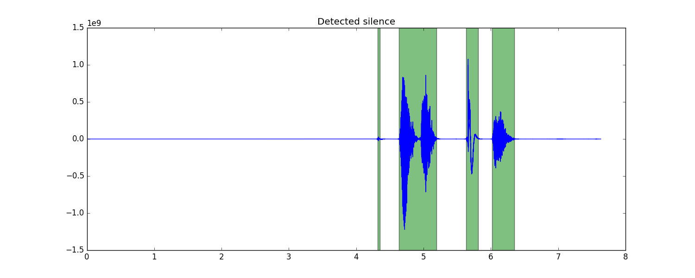

# SpeechCompactify

## What is it?
SpeechCompactify works by detecting and truncating silence in an audio file and writes the truncated version to a new file. In its early stages, it is really just a convenient tool or handy snippet that can be adapted for other uses. It uses pydub for convenience in loading the audio (which also supports effects such as speeding up the audio &mdash; hence, one can really "compactify" an audio source).

Although it works on any audio file, the intention was to use it for audio files containing spoken words (e.g. lectures). Several studies show that we have an increased capacity to comprehend faster rates of speech (up to 200-250 WPM) than the average conversational rate (around 150 WPM). See [here](https://en.wikipedia.org/wiki/Time-compressed_speech#Education). Therefore, future goals for this project might be to implement specific features to suit this task better.

## Usage
`
python compactify.py [audio filename] [threshold value (optional)]
`

## Plots
Some useful plots are generated upon running compactify.py on an audio file. For the sample .wav file included, here is the result of silence detection, where green areas indicate segments in the audio above the given threshold:

