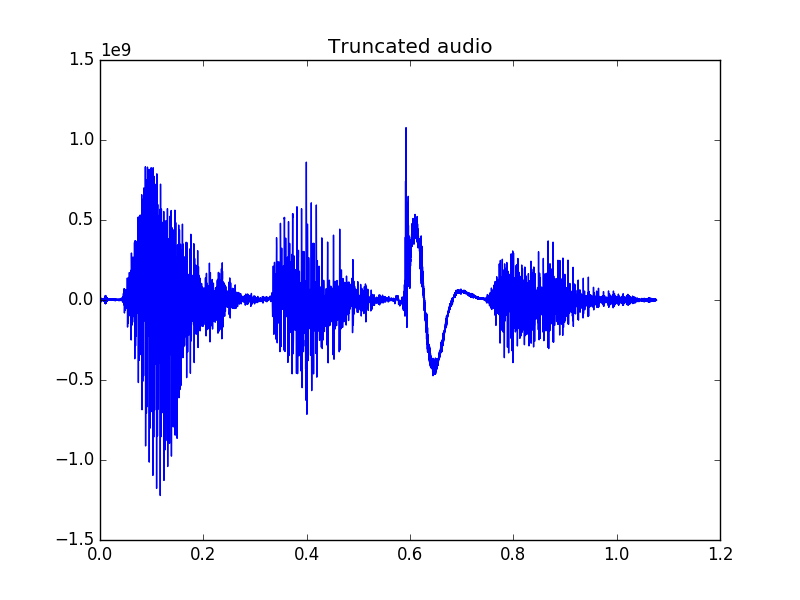

# SpeechCompactify

## What is it?
SpeechCompactify is intended for audio files containing spoken words and works by detecting and truncating silence. In its early stages, it is really just a miniature project that can be improved with time. It uses pydub for convenience in loading the audio.

## Usage
`
python compactify.py [audio filename] [threshold value (optional)]
`

## Plots
Some useful plots are generated upon running compactify.py on an audio file. For the sample .wav file included, here are the outputs of the plots:

